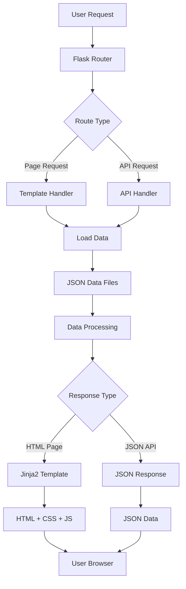

# ChemVista System Architecture

## Overview
ChemVista follows a modern three-tier architecture pattern with clear separation of concerns between presentation, business logic, and data layers.

## Architecture Layers

### 1. Presentation Layer (Frontend)
```
┌─────────────────────────────────────────┐
│              Web Browser                │
│  ┌─────────┐ ┌─────────┐ ┌─────────┐   │
│  │  HTML   │ │   CSS   │ │   JS    │   │
│  │Templates│ │ Styles  │ │ Logic   │   │
│  └─────────┘ └─────────┘ └─────────┘   │
└─────────────────────────────────────────┘
```

**Components:**
- HTML5 templates with Jinja2 templating
- Bootstrap 5.3.0 for responsive design
- Custom CSS with Glass Morphism effects
- Modern JavaScript (ES6+) for interactivity
- Font Awesome icons and Google Fonts

### 2. Application Layer (Backend)
```
┌─────────────────────────────────────────┐
│           Flask Application             │
│  ┌─────────┐ ┌─────────┐ ┌─────────┐   │
│  │ Routes  │ │Business │ │   API   │   │
│  │ Handler │ │  Logic  │ │Endpoints│   │
│  └─────────┘ └─────────┘ └─────────┘   │
└─────────────────────────────────────────┘
```

**Components:**
- Flask web framework (Python 3.7+)
- RESTful API endpoints
- Template rendering engine
- Search and filtering logic
- Error handling and validation

### 3. Data Layer
```
┌─────────────────────────────────────────┐
│            Data Storage                 │
│  ┌─────────┐ ┌─────────┐ ┌─────────┐   │
│  │Elements │ │Compounds│ │ Static  │   │
│  │   JSON  │ │  JSON   │ │ Assets  │   │
│  └─────────┘ └─────────┘ └─────────┘   │
└─────────────────────────────────────────┘
```

**Components:**
- JSON data files for elements and compounds
- File-based storage (easily migrable to database)
- Static assets (CSS, JS, images)
- Configuration files

## Component Interaction Flow



## Security Architecture

### Input Validation
- Flask-WTF forms for CSRF protection
- Input sanitization for search queries
- URL parameter validation
- XSS prevention in templates

### Data Security
- No sensitive data storage
- Public scientific data only
- Secure session management
- Environment variable configuration

## Performance Architecture

### Caching Strategy
```
┌─────────────────────────────────────────┐
│             Caching Layers              │
├─────────────────────────────────────────┤
│  Browser Cache (Static Assets)         │
│  ├─── CSS Files (30 days)              │
│  ├─── JavaScript Files (30 days)       │
│  └─── Images (30 days)                 │
├─────────────────────────────────────────┤
│  Application Cache (Runtime)           │
│  ├─── Element Data (Session)           │
│  ├─── Compound Data (Session)          │
│  └─── Search Index (Memory)            │
└─────────────────────────────────────────┘
```

### Optimization Techniques
- Lazy loading for large datasets
- Debounced search input
- Minified CSS and JavaScript
- CDN for external libraries
- Responsive image serving

## Scalability Architecture

### Horizontal Scaling
```
┌─────────────────────────────────────────┐
│              Load Balancer              │
└─────────────────┬───────────────────────┘
                  │
     ┌────────────┼────────────┐
     │            │            │
┌────▼───┐   ┌────▼───┐   ┌────▼───┐
│Flask   │   │Flask   │   │Flask   │
│App #1  │   │App #2  │   │App #3  │
└────────┘   └────────┘   └────────┘
     │            │            │
     └────────────┼────────────┘
                  │
    ┌─────────────▼─────────────┐
    │       Shared Storage      │
    │    (JSON Data Files)      │
    └───────────────────────────┘
```

### Database Migration Path
```
Current: JSON Files
    ↓
Future: SQLite (Single user)
    ↓
Future: PostgreSQL (Multi-user)
    ↓
Future: Cloud Database (Enterprise)
```

## API Architecture

### RESTful Design
```
GET    /api/elements          # List all elements
GET    /api/elements/{id}     # Get specific element
GET    /api/compounds         # List all compounds
GET    /api/compounds/{id}    # Get specific compound
GET    /api/search           # Search functionality
```

### Response Format
```json
{
  "status": "success",
  "data": {...},
  "meta": {
    "timestamp": "2024-01-01T00:00:00Z",
    "version": "1.0",
    "total": 118
  }
}
```

## Deployment Architecture

### Development Environment
```
Developer Machine
├── Python Virtual Environment
├── Flask Development Server
├── File-based JSON Storage
└── Hot Reload for Templates/Static
```

### Production Environment
```
Production Server
├── WSGI Server (Gunicorn/uWSGI)
├── Reverse Proxy (Nginx)
├── SSL Certificate
├── Process Manager (Supervisor)
└── Logging and Monitoring
```

### Cloud Deployment Options
```
┌─────────────────────────────────────────┐
│               Cloud Options             │
├─────────────────────────────────────────┤
│  Heroku                                 │
│  ├─── Simple deployment                │
│  ├─── Automatic scaling               │
│  └─── Add-on marketplace              │
├─────────────────────────────────────────┤
│  AWS                                    │
│  ├─── EC2 (Virtual machines)          │
│  ├─── Elastic Beanstalk (PaaS)        │
│  └─── Lambda (Serverless)             │
├─────────────────────────────────────────┤
│  Google Cloud                          │
│  ├─── App Engine (PaaS)               │
│  ├─── Compute Engine (IaaS)           │
│  └─── Cloud Run (Containers)          │
└─────────────────────────────────────────┘
```

## Monitoring and Logging

### Application Monitoring
- Error tracking and logging
- Performance metrics
- User analytics
- Search query analysis

### Health Checks
- Application availability
- Response time monitoring
- Resource usage tracking
- Database connectivity

## Future Architecture Considerations

### Microservices Migration
```
Current: Monolithic Flask App
    ↓
Future: Microservices
├── Element Service
├── Compound Service
├── Search Service
└── User Interface Service
```

### Enhanced Features
- Real-time collaborative features
- Advanced search with ML
- 3D molecular visualization
- Multi-language support
- User accounts and preferences
