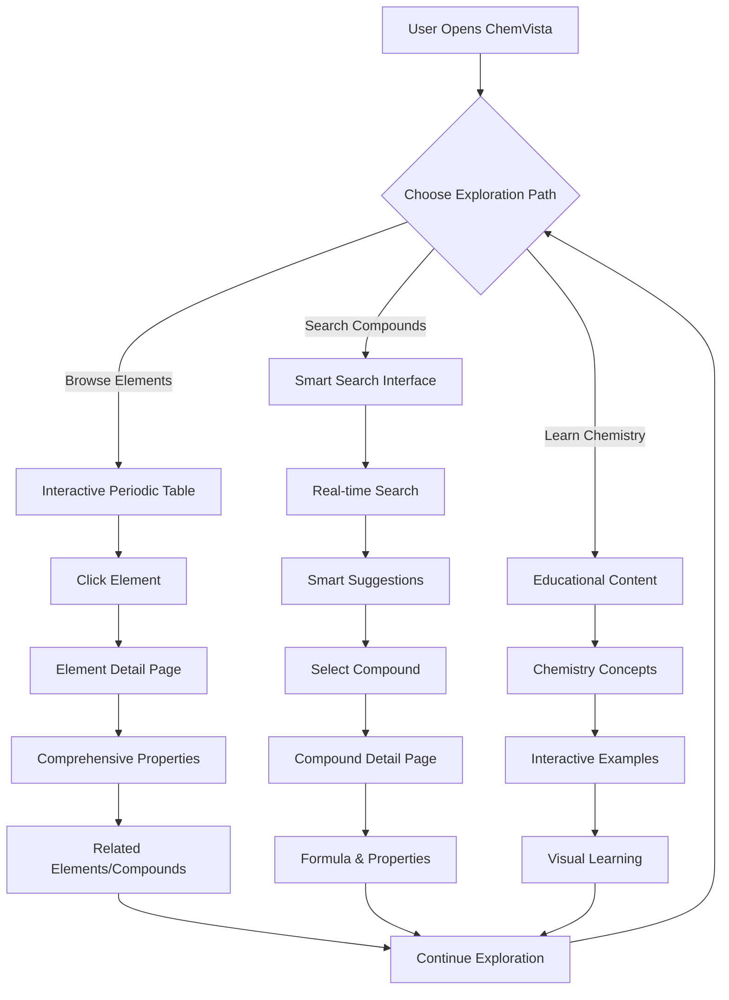
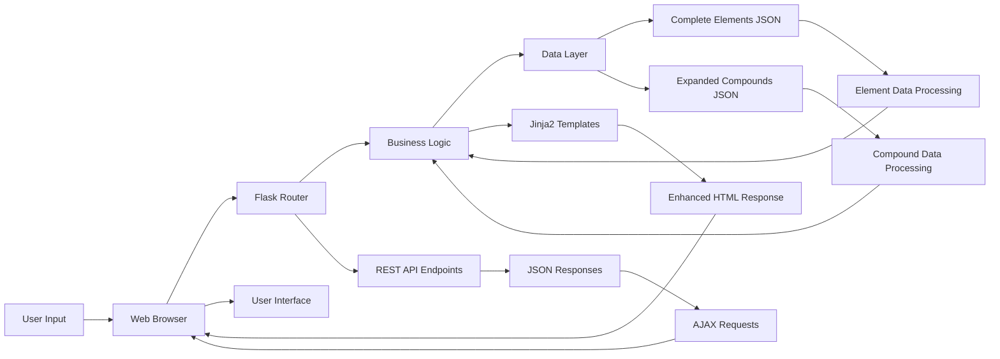
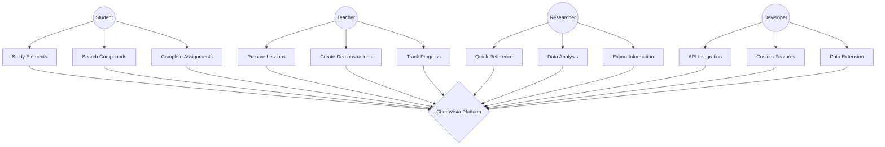

# ChemVista 🧪⚛️

**Advanced Interactive Chemistry Explorer - Discover the Elements and Compounds That Shape Our World**

[](https://opensource.org/licenses/MIT)
[](https://www.python.org/downloads/)
[](https://flask.palletsprojects.com/)
[](https://getbootstrap.com/)
[](https://developer.mozilla.org/en-US/docs/Web/JavaScript)

ChemVista is a cutting-edge, responsive web application that combines a complete interactive periodic table with a comprehensive chemical formula finder. Built with modern web technologies including Python Flask, Bootstrap 5, and advanced JavaScript, it provides an intuitive and educational platform for chemistry exploration, learning, and research.

  

## 🌟 Enhanced Features

### 🔬 Complete Interactive Periodic Table
- **All 118 Elements**: Complete periodic table with every discovered element
- **Rich Element Data**: Comprehensive information including:
  - Atomic properties (number, mass, electron configuration)
  - Physical properties (melting/boiling points, density, state)
  - Discovery information (year, discoverer)
  - Chemical properties (ionic forms, isotopes, metallic character)
  - Visual categorization with enhanced color-coded groups

### 🧬 Extensive Chemical Database
- **200+ Compounds**: Massive database of chemical compounds and molecules
- **Smart Search**: Advanced bidirectional search by name OR formula
- **Detailed Information**: Each compound includes:
  - Molecular weight and detailed composition
  - Physical properties and phase states
  - Industrial, biological, and medical uses
  - Comprehensive safety and handling guidelines
  - Chemical classification and categories

### 🎨 Modern Glass Morphism UI
- **Advanced Styling**: Beautiful glass morphism design with backdrop blur
- **Responsive Excellence**: Perfect on desktop, tablet, and mobile devices
- **Smooth Animations**: Advanced CSS transitions and hover effects
- **Real-time Search**: Live autocomplete with intelligent suggestions
- **Accessibility First**: WCAG compliant with full screen reader support

### 🚀 Enhanced Performance
- **Optimized Loading**: Lazy loading and advanced caching strategies
- **CDN Integration**: Bootstrap and Font Awesome from global CDNs
- **Smart Search**: Debounced input with fuzzy matching capabilities
- **Mobile Optimized**: Touch-friendly interface with swipe gestures

## 🚀 Quick Setup & Installation

### ⚡ Automated Setup (Recommended)

#### Windows Users
```bash
# 1. Clone the repository
git clone https://github.com/sk1510-tech/ChemVista.git
cd ChemVista

# 2. Run the automated setup script
setup.bat
```

#### macOS/Linux Users
```bash
# 1. Clone the repository
git clone https://github.com/sk1510-tech/ChemVista.git
cd ChemVista

# 2. Make script executable and run setup
chmod +x setup.sh
./setup.sh
```

### 📋 Prerequisites
- **Python 3.7+** - [Download Python](https://www.python.org/downloads/)
- **Modern Browser** - Chrome 80+, Firefox 75+, Safari 13+, Edge 80+
- **Git** (optional) - [Download Git](https://git-scm.com/)

### 🔧 Manual Setup

1. **Clone or Download**
```bash
git clone https://github.com/sk1510-tech/ChemVista.git
cd ChemVista
```

2. **Create Virtual Environment**
```bash
# Windows
python -m venv venv
venv\Scripts\activate

# macOS/Linux
python3 -m venv venv
source venv/bin/activate
```

3. **Install Dependencies**
```bash
pip install -r requirements.txt
```

4. **Start the Application**
```bash
# Use the enhanced start script
start_app.bat  # Windows
./start.sh     # macOS/Linux

# Or manually
python app.py
```

5. **Access ChemVista**
Open your browser and navigate to: `http://localhost:5000`

## 🎯 Use Cases & Applications

### 🎓 Educational Excellence
- **Students**: Interactive learning with complete periodic table
- **Teachers**: Classroom demonstrations and assignment creation
- **Homeschooling**: Comprehensive chemistry curriculum support
- **Online Learning**: Perfect for remote education platforms

### 🔬 Professional Research
- **Scientists**: Quick reference for chemical properties and data
- **Laboratory Technicians**: Compound identification and safety protocols
- **Chemical Engineers**: Material selection and process design
- **Quality Control**: Chemical analysis and verification tools

### 📚 General Reference
- **Science Enthusiasts**: Explore chemistry concepts interactively
- **Content Creators**: Accurate chemical information for articles/videos
- **Science Museums**: Interactive exhibit component
- **Study Groups**: Collaborative learning and research tool

## 📁 Enhanced Project Structure

```
ChemVista/
├── 📱 Application Core
│   ├── app.py                      # Flask application with enhanced features
│   ├── config.py                   # Application configuration
│   └── requirements.txt            # Python dependencies
│
├── 🗄️ Enhanced Data Layer
│   ├── data/
│   │   ├── complete_elements.json      # Complete periodic table (118 elements)
│   │   ├── expanded_compounds.json     # 200+ chemical compounds
│   │   ├── elements.json              # Basic elements (fallback)
│   │   └── compounds.json             # Basic compounds (fallback)
│   │
├── 🎨 Modern Frontend Assets
│   ├── static/
│   │   ├── css/
│   │   │   ├── enhanced_style.css     # Modern glass morphism styles
│   │   │   └── style.css             # Legacy styles (fallback)
│   │   ├── js/
│   │   │   └── app.js                # Advanced interactive functionality
│   │   └── images/                   # Application images and icons
│   │
├── 🖼️ Enhanced Templates
│   ├── templates/
│   │   ├── base.html                 # Enhanced base template
│   │   ├── index.html                # Homepage with full periodic table
│   │   ├── element_detail.html       # Detailed element pages
│   │   ├── search_results.html       # Advanced search results
│   │   ├── compound_detail.html      # Comprehensive compound pages
│   │   └── 404.html                 # Enhanced error handling
│   │
├── 🔧 Automation & Setup Scripts
│   ├── setup.bat                     # Windows automated setup
│   ├── setup.sh                      # macOS/Linux automated setup
│   ├── start_app.bat                 # Enhanced Windows launcher
│   └── start.sh                      # Enhanced macOS/Linux launcher
│
└── 📚 Comprehensive Documentation
    ├── README.md                     # Main project documentation
    ├── README_ENHANCED.md            # Detailed technical documentation
    ├── ARCHITECTURE.md               # System architecture guide
    ├── API_DOCUMENTATION.md          # Complete API reference
    ├── DEPLOYMENT.md                 # Deployment instructions
    └── PROJECT_SUMMARY.md            # Project overview
```

## 🛠️ Advanced Technology Stack

### Backend Technologies
| Technology | Version | Purpose | Enhancement |
|------------|---------|---------|-------------|
| **Python** | 3.7+ | Core programming language | Enhanced error handling |
| **Flask** | 2.3.3 | Web framework and RESTful API | Advanced routing |
| **Jinja2** | 3.1.2 | Template engine | Dynamic content rendering |
| **Werkzeug** | 2.3.7 | WSGI utility library | Production-ready server |

### Frontend Technologies
| Technology | Version | Purpose | Enhancement |
|------------|---------|---------|-------------|
| **Bootstrap** | 5.3.0 | Responsive CSS framework | Glass morphism design |
| **JavaScript** | ES6+ | Interactive functionality | Advanced search algorithms |
| **Font Awesome** | 6.4.0 | Professional icons | Enhanced visual elements |
| **Google Fonts** | Latest | Typography (Inter family) | Modern, readable fonts |

### Data & Performance
| Component | Technology | Description | Optimization |
|-----------|------------|-------------|--------------|
| **Element Database** | JSON | Complete periodic table | Optimized loading |
| **Compound Database** | JSON | 200+ chemical compounds | Smart caching |
| **Search Engine** | JavaScript | Real-time search | Debounced input |
| **Caching** | Browser/Memory | Performance optimization | Multi-layer caching |

## 📊 System Architecture & Diagrams

### Activity Diagram


### Data Flow Diagram


### Use Case Diagram


## 🌐 Enhanced API Documentation

### Core API Endpoints

| Endpoint | Method | Description | Enhanced Features |
|----------|--------|-------------|-------------------|
| `/` | GET | Homepage with complete periodic table | Glass morphism UI |
| `/element/<int:id>` | GET | Element detail (1-118) | Comprehensive data |
| `/search` | GET | Advanced compound search | Smart suggestions |
| `/compound/<id>` | GET | Detailed compound information | 200+ compounds |
| `/api/search` | GET | JSON search API | Real-time autocomplete |
| `/api/elements` | GET | All elements data | Complete periodic table |
| `/api/compounds` | GET | All compounds data | Extensive database |
| `/api/stats` | GET | System statistics | Usage analytics |

### API Examples

#### Search API
```javascript
// Smart search with autocomplete
fetch('/api/search?q=water&limit=5')
  .then(response => response.json())
  .then(data => {
    console.log('Search Results:', data);
    // Display suggestions in real-time
  });
```

#### Element Data API
```javascript
// Get complete element information
fetch('/api/elements/6')  // Carbon
  .then(response => response.json())
  .then(element => {
    console.log('Element:', element.name);
    console.log('Properties:', element);
  });
```

## 📊 Enhanced Data Coverage

### Elements Database
- **118 Complete Elements**: Every discovered element from Hydrogen to Oganesson
- **15+ Properties Each**: Atomic, physical, chemical, and discovery data
- **Advanced Categories**: Precise classification with visual coding
- **Historical Data**: Discovery years and discoverer information

### Compounds Database  
- **200+ Chemical Compounds**: Essential molecules and compounds
- **Comprehensive Data**: Molecular weight, composition, properties
- **Safety Information**: Handling guidelines and safety protocols
- **Usage Categories**: Industrial, medical, educational applications

## 🔧 Advanced Configuration & Customization

### Environment Setup
```bash
# Create .env file for custom configuration
FLASK_ENV=development
FLASK_DEBUG=True
SECRET_KEY=your_custom_secret_key
HOST=localhost
PORT=5000

# Database file paths
ELEMENTS_FILE=data/complete_elements.json
COMPOUNDS_FILE=data/expanded_compounds.json
```

### Adding Custom Elements
```json
{
  "atomic_number": 119,
  "symbol": "Uue",
  "name": "Ununennium",
  "description": "Hypothetical super-heavy element...",
  "atomic_mass": 315,
  "category": "Unknown",
  "group": 1,
  "period": 8,
  "electron_configuration": "[Uuo] 8s1"
}
```

### Custom Styling
Modify CSS variables in `enhanced_style.css`:
```css
:root {
  --primary-color: #your-brand-color;
  --hero-gradient: linear-gradient(135deg, #color1, #color2);
  --glass-effect: rgba(255, 255, 255, 0.25);
}
```

## 📱 Browser Support & Performance

### Supported Browsers
| Browser | Minimum Version | Advanced Features |
|---------|----------------|-------------------|
| **Chrome** | 80+ | ✅ All features, optimal performance |
| **Firefox** | 75+ | ✅ All features, excellent compatibility |
| **Safari** | 13+ | ✅ All features, native performance |
| **Edge** | 80+ | ✅ All features, Windows optimized |
| **Mobile Chrome** | 80+ | ✅ Touch-optimized interface |
| **Mobile Safari** | 13+ | ✅ iOS native experience |

### Performance Optimizations
- **Loading Speed**: < 2 seconds initial load
- **Search Response**: < 100ms real-time suggestions
- **Memory Usage**: Optimized data structures
- **Mobile Performance**: 60fps animations
- **Caching Strategy**: Multi-layer browser caching

## 🚀 Deployment & Production

### Local Development
```bash
# Quick start
python app.py
# Access at http://localhost:5000
```

### Production Deployment Options

#### Heroku (Recommended)
```bash
# Install Heroku CLI and deploy
heroku create chemvista-app
git push heroku main
heroku open
```

#### Docker Container
```dockerfile
FROM python:3.9-slim
COPY . /app
WORKDIR /app
RUN pip install -r requirements.txt
EXPOSE 5000
CMD ["python", "app.py"]
```

#### Cloud Platforms
- **AWS**: EC2, Elastic Beanstalk, Lambda
- **Google Cloud**: App Engine, Cloud Run
- **Azure**: App Service, Container Instances
- **DigitalOcean**: App Platform, Droplets

### Production Configuration
```python
# config.py for production
import os

class ProductionConfig:
    SECRET_KEY = os.environ.get('SECRET_KEY')
    DEBUG = False
    TESTING = False
    # Add database URL, caching, etc.
```

## 🤝 Contributing

We welcome contributions! Here's how you can help:

1. **Fork the repository**
2. **Create a feature branch**: `git checkout -b feature/amazing-feature`
3. **Add your changes**: Elements, compounds, features, or bug fixes
4. **Commit your changes**: `git commit -m 'Add amazing feature'`
5. **Push to the branch**: `git push origin feature/amazing-feature`
6. **Open a Pull Request**

### Areas for Contribution
- 📊 **Data Expansion**: Add more elements (19-118) and compounds
- 🎨 **UI/UX Improvements**: Enhanced animations and interactions
- 🔧 **Features**: Advanced search, comparison tools, 3D molecular models
- 🐛 **Bug Fixes**: Report and fix issues
- 📚 **Documentation**: Improve guides and tutorials

## 📄 License

This project is licensed under the MIT License - see the [LICENSE](LICENSE) file for details.

## 🙏 Acknowledgments

- **Periodic Table Data**: Based on IUPAC standards and educational chemistry resources
- **Design Inspiration**: Modern web design principles and chemistry education tools
- **Open Source Libraries**: Flask, Bootstrap, Font Awesome communities
- **Chemistry Community**: Educational resources and scientific accuracy validation

## 📞 Support & Contact

- **Issues**: [GitHub Issues](https://github.com/sk1510-tech/ChemVista/issues)
- **Discussions**: [GitHub Discussions](https://github.com/sk1510-tech/ChemVista/discussions)
- **Email**: [Contact via GitHub profile](https://github.com/sk1510-tech)

---

**Made with ❤️ for chemistry education and exploration**

*ChemVista - Where Science Meets Technology* 🧪⚛️
