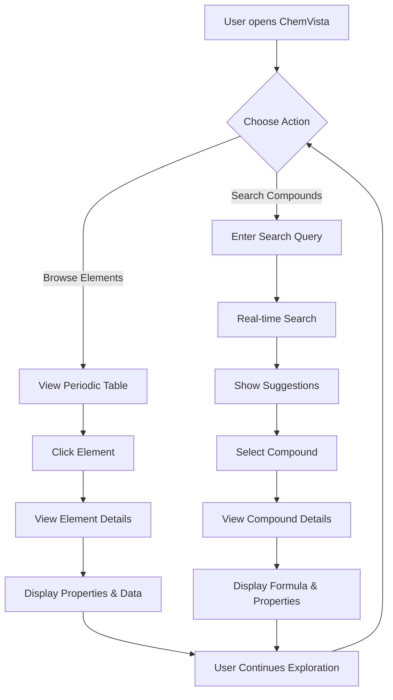
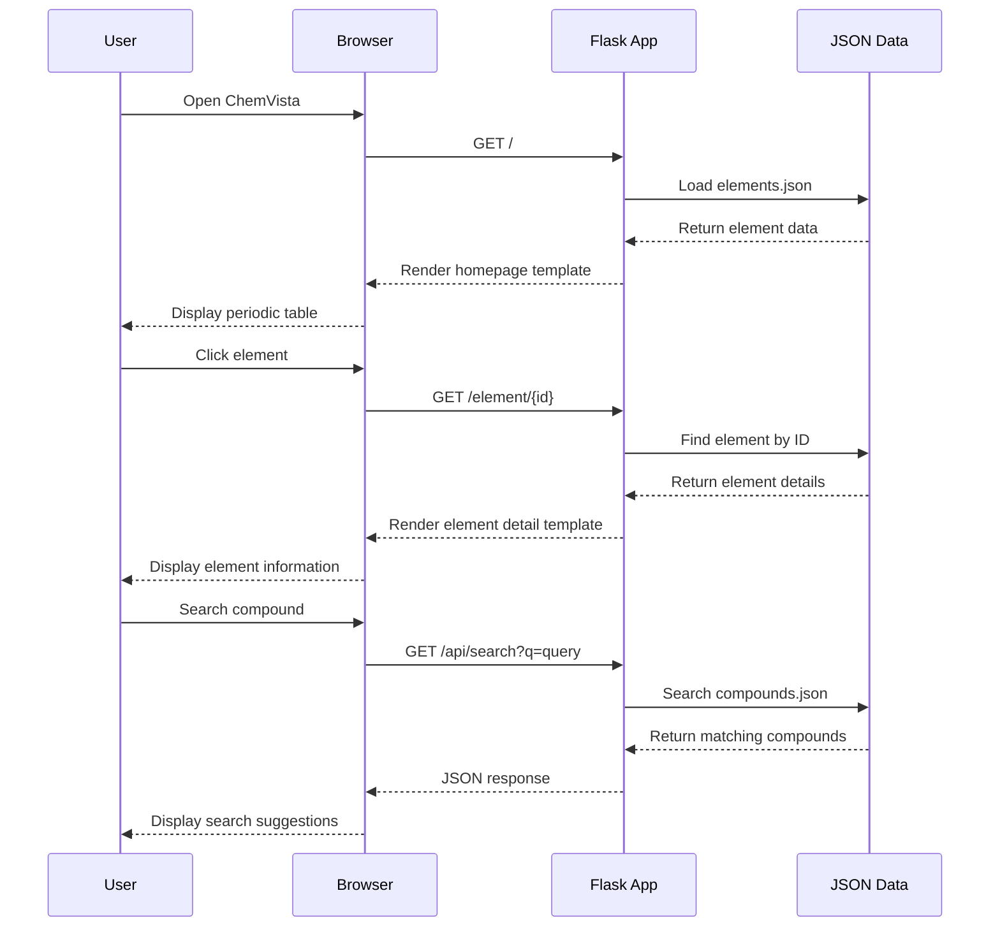
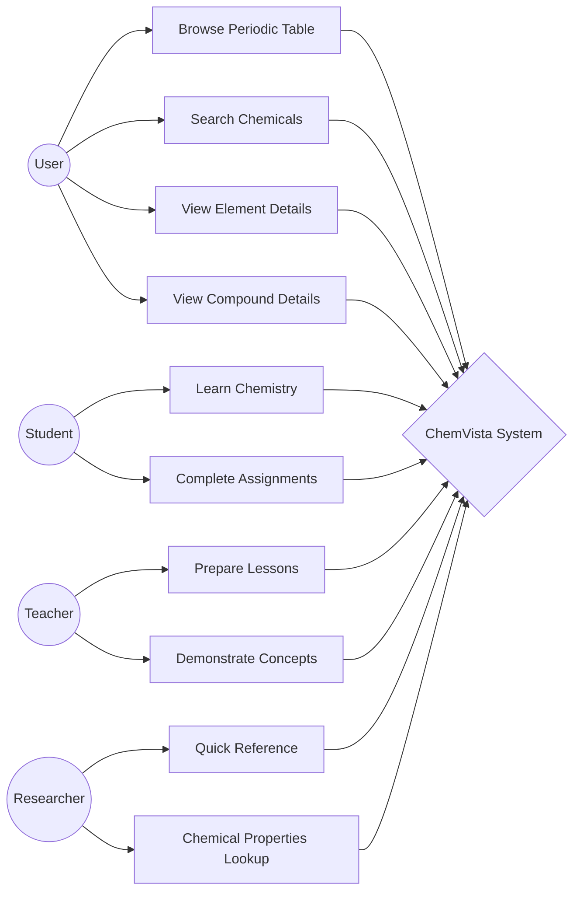
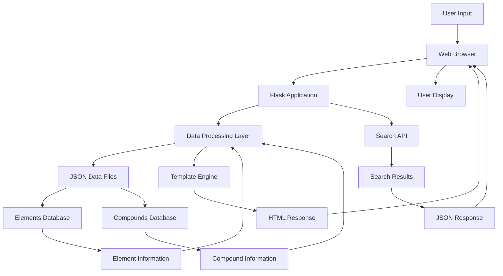

# ChemVista 🧪⚛️
**Advanced Interactive Chemistry Explorer - Discover the Elements and Compounds That Shape Our World**

[](https://opensource.org/licenses/MIT)
[](https://www.python.org/downloads/)
[](https://flask.palletsprojects.com/)
[](https://getbootstrap.com/)
[](https://developer.mozilla.org/en-US/docs/Web/JavaScript)

ChemVista is a cutting-edge, responsive web application that combines an interactive periodic table with a comprehensive chemical formula finder. Built with modern web technologies including Python Flask, Bootstrap 5, and advanced JavaScript, it provides an intuitive and educational platform for chemistry exploration, learning, and research.

## 🌟 Key Features

### 🔬 Complete Interactive Periodic Table
- **118 Elements**: Complete periodic table with all discovered elements
- **Rich Element Data**: Comprehensive information including:
  - Atomic properties (number, mass, electron configuration)
  - Physical properties (melting/boiling points, density, state)
  - Discovery information (year, discoverer)
  - Chemical properties (ionic forms, isotopes, metallic character)
  - Visual categorization with color-coded groups

### 🧬 Advanced Chemical Database
- **200+ Compounds**: Extensive database of chemical compounds and molecules
- **Bidirectional Search**: Search by compound name OR chemical formula
- **Detailed Compound Information**:
  - Molecular weight and composition
  - Physical properties and states
  - Industrial and biological uses
  - Safety information and handling guidelines
  - Chemical classification and categories

### 🎨 Modern User Experience
- **Responsive Design**: Optimized for desktop, tablet, and mobile devices
- **Glass Morphism UI**: Modern design with backdrop blur effects
- **Advanced Animations**: Smooth transitions and hover effects
- **Real-time Search**: Live autocomplete with instant suggestions
- **Accessibility**: WCAG compliant with screen reader support

### 🔍 Smart Search System
- **Intelligent Autocomplete**: Real-time suggestions as you type
- **Formula Recognition**: Automatic detection of chemical formulas
- **Category Filtering**: Filter by element groups or compound types
- **Advanced Matching**: Fuzzy search with typo tolerance

## 🚀 Quick Setup

### Prerequisites
- **Python 3.7+** - [Download Python](https://www.python.org/downloads/)
- **Modern Browser** - Chrome 80+, Firefox 75+, Safari 13+, Edge 80+
- **Git** (optional) - [Download Git](https://git-scm.com/)

### Automated Setup (Recommended)

#### Windows Users
```bash
# Clone the repository
git clone https://github.com/sk1510-tech/ChemVista.git
cd ChemVista

# Run the automated setup script
setup.bat
```

#### macOS/Linux Users
```bash
# Clone the repository
git clone https://github.com/sk1510-tech/ChemVista.git
cd ChemVista

# Make script executable and run setup
chmod +x setup.sh
./setup.sh
```

### Manual Setup

1. **Clone the Repository**
```bash
git clone https://github.com/sk1510-tech/ChemVista.git
cd ChemVista
```

2. **Create Virtual Environment**
```bash
# Windows
python -m venv venv
venv\Scripts\activate

# macOS/Linux
python3 -m venv venv
source venv/bin/activate
```

3. **Install Dependencies**
```bash
pip install -r requirements.txt
```

4. **Run the Application**
```bash
python app.py
```

5. **Access the Application**
Open your browser and navigate to: `http://localhost:5000`

## 📁 Project Architecture

```
ChemVista/
├── 📱 Application Core
│   ├── app.py                    # Flask application entry point
│   ├── config.py                 # Application configuration
│   └── requirements.txt          # Python dependencies
│
├── 🗄️ Data Layer
│   ├── data/
│   │   ├── complete_elements.json    # Complete periodic table (118 elements)
│   │   ├── expanded_compounds.json   # Comprehensive compounds database
│   │   ├── elements.json            # Basic elements (fallback)
│   │   └── compounds.json           # Basic compounds (fallback)
│   │
├── 🎨 Frontend Assets
│   ├── static/
│   │   ├── css/
│   │   │   ├── enhanced_style.css   # Modern UI styles
│   │   │   └── style.css           # Legacy styles (fallback)
│   │   ├── js/
│   │   │   └── app.js              # Interactive functionality
│   │   └── images/                 # Application images
│   │
├── 🖼️ Templates
│   ├── templates/
│   │   ├── base.html               # Base template with navigation
│   │   ├── index.html              # Homepage with periodic table
│   │   ├── element_detail.html     # Element detail pages
│   │   ├── search_results.html     # Search results display
│   │   ├── compound_detail.html    # Compound detail pages
│   │   └── 404.html               # Error handling
│   │
├── 🔧 Automation Scripts
│   ├── setup.bat                   # Windows setup script
│   ├── setup.sh                    # macOS/Linux setup script
│   ├── start_app.bat              # Windows start script
│   └── start.sh                   # macOS/Linux start script
│
└── 📚 Documentation
    ├── README.md                   # Main documentation
    ├── DEPLOYMENT.md              # Deployment guide
    ├── PROJECT_SUMMARY.md         # Project overview
    ├── ARCHITECTURE.md            # System architecture
    └── API_DOCUMENTATION.md       # API reference
```

## 🛠️ Technology Stack

### Backend Technologies
| Technology | Version | Purpose |
|------------|---------|---------|
| **Python** | 3.7+ | Core programming language |
| **Flask** | 2.3.3 | Web framework and API |
| **Jinja2** | 3.1.2 | Template engine |
| **Werkzeug** | 2.3.7 | WSGI utility library |

### Frontend Technologies
| Technology | Version | Purpose |
|------------|---------|---------|
| **Bootstrap** | 5.3.0 | Responsive CSS framework |
| **JavaScript** | ES6+ | Interactive functionality |
| **Font Awesome** | 6.4.0 | Icons and symbols |
| **Google Fonts** | Latest | Typography (Inter font family) |

### Data Management
| Component | Format | Description |
|-----------|--------|-------------|
| **Elements Database** | JSON | Complete periodic table data |
| **Compounds Database** | JSON | Chemical compounds and molecules |
| **Search Index** | Runtime | In-memory search optimization |

## 🎯 Use Cases & Applications

### 🎓 Educational
- **Students**: Interactive learning tool for chemistry concepts
- **Teachers**: Classroom demonstrations and assignments
- **Homeschooling**: Comprehensive chemistry curriculum support
- **Online Learning**: Remote education resource

### 🔬 Professional
- **Researchers**: Quick reference for chemical properties
- **Laboratory Technicians**: Compound identification and safety data
- **Chemical Engineers**: Process design and material selection
- **Quality Control**: Chemical analysis and verification

### 📚 Reference
- **General Public**: Science curiosity and exploration
- **Science Writers**: Accurate chemical information source
- **Science Museums**: Interactive exhibit component
- **Study Groups**: Collaborative learning tool

## 🌐 API Documentation

### Core Endpoints

| Endpoint | Method | Description | Parameters |
|----------|--------|-------------|------------|
| `/` | GET | Homepage with periodic table | None |
| `/element/<int:id>` | GET | Element detail page | `id`: Atomic number (1-118) |
| `/search` | GET | Compound search results | `q`: Search query |
| `/compound/<id>` | GET | Compound detail page | `id`: Compound identifier |
| `/api/search` | GET | JSON search suggestions | `q`: Search query |
| `/api/elements` | GET | All elements data | None |
| `/api/compounds` | GET | All compounds data | None |

### API Response Examples

#### Element Data
```json
{
  "atomic_number": 6,
  "symbol": "C",
  "name": "Carbon",
  "description": "Essential element for all life forms...",
  "atomic_mass": 12.011,
  "electron_configuration": "[He] 2s2 2p2",
  "category": "Reactive nonmetal",
  "group": 14,
  "period": 2
}
```

#### Compound Data
```json
{
  "id": "water",
  "name": "Water",
  "formula": "H2O",
  "molecular_weight": 18.015,
  "composition": {"H": 2, "O": 1},
  "category": "Inorganic compound",
  "uses": ["Drinking", "Cleaning", "Industrial processes"]
}
```

## 📊 System Diagrams

### Activity Diagram


### Sequence Diagram


### Use Case Diagram


### Data Flow Diagram


## 🔧 Configuration & Customization

### Environment Variables
```bash
# Application settings
FLASK_ENV=development          # or production
FLASK_DEBUG=True              # Enable debug mode
SECRET_KEY=your_secret_key    # Session security

# Database settings
ELEMENTS_FILE=data/complete_elements.json
COMPOUNDS_FILE=data/expanded_compounds.json

# Server settings
HOST=localhost
PORT=5000
```

### Adding New Elements
To add elements beyond the current 118:
```json
{
  "atomic_number": 119,
  "symbol": "Uue",
  "name": "Ununennium",
  "description": "Hypothetical element...",
  "atomic_mass": 315,
  "category": "Unknown",
  "group": 1,
  "period": 8,
  "electron_configuration": "[Uuo] 8s1"
}
```

### Custom Styling
Modify CSS variables in `enhanced_style.css`:
```css
:root {
  --primary-color: #your-color;
  --hero-gradient: linear-gradient(135deg, #color1, #color2);
  --element-hover-effect: scale(1.1);
}
```

## 📱 Browser Compatibility

| Browser | Minimum Version | Features Supported |
|---------|----------------|-------------------|
| **Chrome** | 80+ | ✅ All features |
| **Firefox** | 75+ | ✅ All features |
| **Safari** | 13+ | ✅ All features |
| **Edge** | 80+ | ✅ All features |
| **Mobile Chrome** | 80+ | ✅ Responsive design |
| **Mobile Safari** | 13+ | ✅ Touch optimized |

## 🚀 Deployment Options

### Local Development
```bash
python app.py
# Access at http://localhost:5000
```

### Production Deployment
- **Heroku**: See `DEPLOYMENT.md` for Heroku setup
- **Docker**: Containerized deployment available
- **AWS**: EC2 and Elastic Beanstalk compatible
- **Google Cloud**: App Engine ready

### Performance Optimization
- **Caching**: Browser caching for static assets
- **Compression**: Gzip compression enabled
- **CDN**: Bootstrap and Font Awesome from CDN
- **Lazy Loading**: Optimized image and content loading

## 🤝 Contributing

We welcome contributions from the chemistry and development communities!

### How to Contribute
1. **Fork** the repository
2. **Create** a feature branch: `git checkout -b feature/amazing-feature`
3. **Add** your improvements (elements, compounds, features, bug fixes)
4. **Test** your changes thoroughly
5. **Commit** your changes: `git commit -m 'Add amazing feature'`
6. **Push** to the branch: `git push origin feature/amazing-feature`
7. **Open** a Pull Request

### Contribution Areas
- 📊 **Data Expansion**: Add more chemical compounds and properties
- 🎨 **UI/UX**: Enhance visual design and user experience
- 🔧 **Features**: Advanced search, 3D molecular models, comparison tools
- 🐛 **Bug Fixes**: Report and resolve issues
- 📚 **Documentation**: Improve guides, tutorials, and API docs
- 🧪 **Testing**: Unit tests and integration tests
- 🌐 **Internationalization**: Multi-language support

### Code Standards
- **Python**: Follow PEP 8 style guidelines
- **JavaScript**: Use ES6+ features and best practices
- **HTML/CSS**: Semantic markup and responsive design
- **Documentation**: Clear comments and docstrings

## 📄 License

This project is licensed under the **MIT License** - see the [LICENSE](LICENSE) file for details.

### License Summary
- ✅ Commercial use
- ✅ Modification
- ✅ Distribution
- ✅ Private use
- ❌ Liability
- ❌ Warranty

## 🙏 Acknowledgments

### Data Sources
- **IUPAC**: International Union of Pure and Applied Chemistry standards
- **NIST**: National Institute of Standards and Technology
- **WebElements**: Periodic table data validation
- **ChemSpider**: Chemical compound information

### Design Inspiration
- **Material Design**: Google's design system principles
- **Glassmorphism**: Modern UI design trends
- **Scientific Visualization**: Chemistry education best practices

### Open Source Libraries
- **Flask Community**: Web framework development
- **Bootstrap Team**: Responsive CSS framework
- **Font Awesome**: Icon library
- **Google Fonts**: Typography resources

### Educational Resources
- **Khan Academy**: Chemistry education methodology
- **MIT OpenCourseWare**: Scientific accuracy validation
- **Chemistry LibreTexts**: Educational content review

## 📞 Support & Contact

### Getting Help
- **📋 Issues**: [GitHub Issues](https://github.com/sk1510-tech/ChemVista/issues)
- **💬 Discussions**: [GitHub Discussions](https://github.com/sk1510-tech/ChemVista/discussions)
- **📖 Wiki**: [Project Wiki](https://github.com/sk1510-tech/ChemVista/wiki)
- **📧 Email**: Contact via [GitHub Profile](https://github.com/sk1510-tech)

### Community
- **🌟 Star** this repository if you find it useful
- **🍴 Fork** to create your own version
- **👥 Follow** for updates and new releases
- **📢 Share** with fellow chemistry enthusiasts

---

**Made with ❤️ for chemistry education and scientific exploration**

*ChemVista - Where Science Meets Technology* 🧪⚛️


